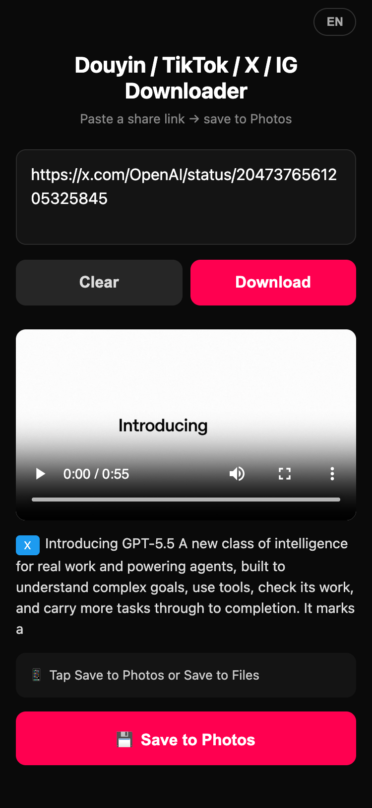
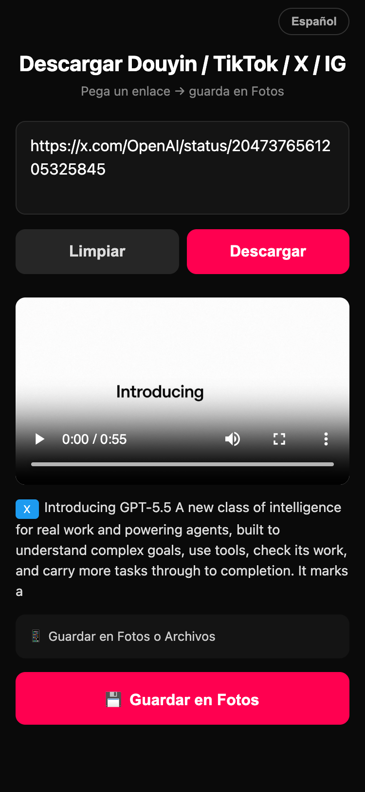
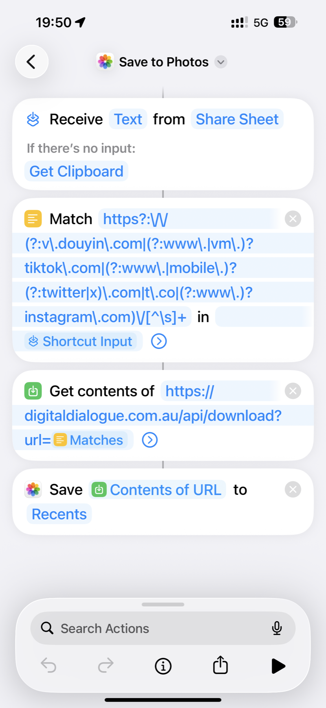

# Douyin, TikTok, X & Instagram Video Downloader

[](https://digitaldialogue.com.au/)
[](LICENSE)

A mobile-first web tool that parses a **Douyin (抖音), TikTok, X (Twitter), or Instagram** share link and saves the **watermark-free MP4** straight into your iPhone **Camera Roll** via the native iOS Share Sheet — no app to install, no sign-up, no ads.

**Zero-bandwidth design**: the web page and every API consumer pull the MP4 **directly from each platform's CDN**. Our server only does the small HTML/JSON parse (~1 KB per video) — **no video bytes transit the server**.

**Two-layer JSON cache**: the parse result (just the metadata, never video bytes) is cached both in-process (module-scope Map, per warm instance) and at the Netlify edge (via `Cache-Control` with per-platform TTL). A viral IG reel pasted by 100 people in 5 minutes hits Instagram's graphql endpoint **once** — the other 99 requests are served from edge cache without ever waking up our function. This is especially important for Instagram, whose graphql endpoint aggressively rate-limits shared-IP pools.

Live at **[digitaldialogue.com.au](https://digitaldialogue.com.au/)**.

<p align="center">
  
  
</p>
<p align="center">
  
  
</p>

---

## Features

- **Douyin, TikTok, X (Twitter) & Instagram** — watermark-free MP4 via per-platform parsing
- **Zero hosting bandwidth** — video bytes flow browser ↔ platform CDN, not through us (see architecture below)
- **Save to Photos on iPhone** — tap once, native Share Sheet opens with "Save Video"
- **Progress prefetch** — the MP4 streams into memory during render so the save click can call `navigator.share()` synchronously (avoids Safari's NotAllowedError from expired user activation)
- **i18n** — 中文 / English / 日本語 / Español, picked by `?lang=` query param or browser locale
- **SEO** — per-language title/description, OG tags, hreflang, canonical, JSON-LD, sitemap, robots.txt
- **Two public APIs** for iOS Shortcuts, both zero-bandwidth, both auto-detect the platform

## How the zero-bandwidth trick works

Each platform has a public endpoint that hands us the CDN URL without authentication. The exact mechanism differs:

| Platform | Page host | Resolution path | Final CDN host | CORS | URL lifetime |
|----------|-----------|-----------------|----------------|------|--------------|
| Douyin   | `www.douyin.com` | server-side `aweme.snssdk.com/aweme/v1/play/` 302 follow | `*.zjcdn.com` / `*.douyinvod.com` | `*` | ~5 min signed |
| TikTok   | `www.tiktok.com` | server-side `www.tiktok.com/aweme/v1/play/` 302 follow (cookieless variant) | `*.tiktokcdn-us.com` | `*` | ~5 min signed |
| X (Twitter) | `cdn.syndication.twimg.com/tweet-result` (oEmbed-style API, no auth) | direct MP4 URL in the JSON response — no 302 | `video.twimg.com` (Cloudflare) | `*` | **1 week** (`max-age=604800`) |
| Instagram | `instagram.com/graphql/query` (`doc_id=8845758582119845`, csrftoken cookie warmup) | direct MP4 URL in the JSON response | `*.cdninstagram.com` | `*` | ~30 min signed |

**Douyin**: `aweme.snssdk.com` has no CORS headers so browsers can't follow its 302 from JS. The redirect target does have ACAO `*` and accepts requests with no Referer (CDN rejects cross-origin Referer as anti-hotlink). We do the follow once server-side.

**TikTok**: same play-redirect endpoint serves *two different Locations* based on whether the request carries `tt_chain_token` cookie. With cookie → `v16-webapp-prime.us.tiktok.com` (cookie-gated, 403 cold). Without cookie → `v16m-default.tiktokcdn-us.com` (signed URL, no header requirements, ACAO `*`). Node fetch has no cookie jar, so the cookieless variant comes back automatically.

**X (Twitter)**: easiest by far. The same `cdn.syndication.twimg.com/tweet-result?id=…` endpoint that powers `publish.twitter.com` returns a JSON with `video.variants[]` listing direct MP4 URLs at multiple resolutions (480p / 720p / 1080p). No 302, no signature, no cookie — just public Cloudflare-cached assets that browsers can `fetch()` directly. We pick the highest resolution.

**Instagram**: most fragile of the four. We POST to `instagram.com/graphql/query/` with `doc_id=8845758582119845` (the same internal doc id Instagram's own embed iframe uses) — the response is JSON with `data.xdt_shortcode_media.video_url` pointing at a `*.cdninstagram.com` signed MP4 (CORS `*`, no header requirements). Three caveats:

1. **IP-level rate limiting on the graphql endpoint.** Shared Netlify IPs get flagged fast — typically the first call works, the next one or two 401 ("require_login") or 429. Both are soft rate-limit signals and we surface them as "请 10-30 分钟后再试". Usually clears within ~30 minutes. Not fixable structurally unless you run on your own IP (VPS) with light traffic, or add per-shortcode caching.
2. **doc_id rotates every few months.** When the parser starts 400-ing with a `doc_id not found` body, look up the current value at [yt-dlp/yt-dlp/blob/master/yt_dlp/extractor/instagram.py](https://github.com/yt-dlp/yt-dlp/blob/master/yt_dlp/extractor/instagram.py) (search for `doc_id`).
3. **Carousel posts** return the first video child. **Stories / Highlights / private / age-restricted / region-locked** content fails with "未返回视频元数据".

```
Browser                  Netlify Function              Platform
───────                  ────────────────              ──────────
  │                            │                          │
  ├─ POST /parse ────────────> │                          │
  │                            ├─ extract video URL       │  Douyin/TikTok: page+302
  │                            │  (per-platform path) ──> │  Twitter:   syndication API
  │                            │                          │  Instagram: graphql doc_id
  │<── { direct_cdn_url, … } ──│                          │
  │                                                       │
  ├─ GET direct_cdn_url (no Referer, no cookies) ──────> │
  │<── MP4 bytes ←─ 2-15 MB straight from platform CDN ──│
  │   (<video> plays + File for navigator.share)          │
```

## API for iOS Shortcuts

### `/api/download` — simplest, zero-bandwidth

```
GET https://digitaldialogue.com.au/api/download?url=<share_link>
→ 302 Location: https://v5-dy-o-abtest.zjcdn.com/.../video.mp4
```

The server 302-redirects to the CDN; the Shortcut's HTTP client follows the redirect and pulls bytes straight from Douyin. **Zero bytes transit our server.**

<p align="center">
  
</p>

#### One-tap install (recommended)

Open this link on your iPhone in **Safari** (not Chrome):

→ **[icloud.com/shortcuts/17c985426a4048849ae5691158b37ab6](https://www.icloud.com/shortcuts/17c985426a4048849ae5691158b37ab6)**

Tap **Add Shortcut** → done. The Shortcut is named *Save to Photos* and is pre-wired with the regex below + every setting in place.

> ⚠️ **iOS Photos sorts the Library by capture date, not save date.** A video posted a week ago will land where last week's photos are, not at the top. To see what you just saved, look in **Photos → Albums → Recents** (sorted by add date) or scroll Library.

#### Use it

Open Douyin / TikTok / X / Instagram → tap any video's **Share** button → swipe the Shortcuts row and pick yours → a few seconds later the video is in Photos. If you just have a share link on the clipboard, run the Shortcut from the home screen / widget instead.

> ⚠️ **Don't tap the ▶ Play button in the Shortcuts editor to test.** It runs without Share Sheet input, so step 1 silently falls through to Clipboard — if that doesn't contain a supported link you'll get a confusing error. Always test via the real share menu.

#### Building it manually (if you can't import the iCloud link)

Open the **Shortcuts** app → tap **+** to create a new Shortcut.

**First: enable Share Sheet in settings (NOT in actions).** Tap the **ⓘ info icon** at the bottom of the editor → toggle **Show in Share Sheet** on → for **Share Sheet Types** keep **only Text** checked and uncheck everything else (including URLs). Name it e.g. *Save to Photos*.

> ⚠️ "Receive Input" is a Shortcut **setting**, not an action you can search for. If you skip the toggle above, the Shortcut won't appear in any app's share menu.
>
> ⚠️ **Accept Text, not URLs.** Douyin's share blob looks like `8.97 复制打开抖音… https://v.douyin.com/XXXX/ S@Y.MW YMW:/ 12/07`. If you accept URLs, iOS auto-extracts `S@Y.MW` as `mailto:S@Y.MW` and you'll hit *"URL is missing a hostname"*.

Then add these 4 actions:

1. **Receive Text from Share Sheet** — type Text; if no input → **Get Clipboard**.
2. **Match Text** — pattern `https?:\/\/(?:v\.douyin\.com|(?:www\.|vm\.)?tiktok\.com|(?:www\.|mobile\.)?(?:twitter|x)\.com|t\.co|(?:www\.)?instagram\.com)\/[^\s]+` against **Shortcut Input**.
3. **Get Contents of URL** — `https://digitaldialogue.com.au/api/download?url=` + **Matches** variable. Method: **GET**.
4. **Save to Photo Album** — input **Contents of URL** → album **Recents**.

### `/api/info` — same zero bandwidth, but returns JSON if you want finer control

```
GET https://digitaldialogue.com.au/api/info?url=<share_link>
→ 200 application/json
{
  "platform": "twitter",                              // or "douyin", "tiktok"
  "filename": "twitter_2031895801064985021.mp4",
  "title": "STRIKE. 💥🦅 ...",
  "direct": {
    "url": "https://video.twimg.com/amplify_video/.../1920x1080/...mp4",
    "headers": { "User-Agent": "..." },
    "note": "Standard GET — video.twimg.com is a public Cloudflare CDN with cache-control: max-age=604800."
  },
  "download_url": "https://digitaldialogue.com.au/api/download?url=..."
}
```

Use this if you want to inspect metadata (title, cover, video_id) inside your Shortcut before fetching, or if you want to set a custom User-Agent.

## MCP for AI assistants

A [Model Context Protocol](https://modelcontextprotocol.io) server exposes the same parser as a tool any AI assistant can call directly — paste a share link into Claude / ChatGPT / Cursor / Cline, the AI calls our `download_video` tool, gets the CDN URL, and hands it to you.

```
POST https://digitaldialogue.com.au/mcp
Content-Type: application/json
```

Streamable HTTP transport, JSON-RPC 2.0, stateless, no auth (the underlying API is already public). Same zero-bandwidth principle as the `/api/*` endpoints — tool calls return the CDN URL; bytes flow client ↔ platform CDN.

### Connect

**Claude.ai (web / desktop / mobile):**
1. Open https://claude.ai/customize/connectors
2. **Add custom connector** → URL `https://digitaldialogue.com.au/mcp` → save
3. The `download_video` tool is now available in any conversation

**Claude Code / Cursor / Cline / any MCP client:** add to your MCP config:

```json
{
  "mcpServers": {
    "digitaldialogue": {
      "type": "http",
      "url": "https://digitaldialogue.com.au/mcp"
    }
  }
}
```

### Tool

| Name | Input | Output |
|------|-------|--------|
| `download_video` | `share_url` (string) | `{ platform, title, cdn_url, cover_image_url, video_id, item_id, recommended_user_agent, cdn_lifetime_seconds, suggested_filename }` |

Errors surface as `isError: true` tool results with the same human-readable messages used by `/api/info` (e.g. `Instagram 风控中，请 10-30 分钟后再试` for the documented IG IP-pool rate-limit).

### Probe it

```
$ curl https://digitaldialogue.com.au/mcp
{
  "name": "digitaldialogue",
  "title": "Douyin / TikTok / X / Instagram Video Downloader",
  "version": "1.0.0",
  "protocol": "mcp-streamable-http",
  "protocol_version": "2025-06-18",
  "transport": "POST application/json (JSON-RPC 2.0); single endpoint",
  "tools": ["download_video"]
}
```

## Caching strategy (JSON metadata only — video bytes are never cached)

Two layers, both keyed on the input share URL:

| Layer | Where | Lifetime | Scope | What's stored |
|-------|-------|----------|-------|---------------|
| Module-scope `Map` | Node.js process memory on a warm Netlify function instance | per-platform TTL (see below), capped at 500 entries | one function instance | `{ platform, direct_cdn_url, title, cover, item_id, video_id, ... }` — ~500 bytes |
| Netlify edge cache | CDN PoPs globally | same TTL, via `Cache-Control: public, max-age=N, s-maxage=N` | all users everywhere | the HTTP JSON response |

Per-platform TTL is chosen *shorter* than the platform's own signed-URL expiry so a cache hit never hands out an expired CDN URL:

| Platform | Cache TTL | CDN URL lifetime |
|----------|-----------|------------------|
| Twitter / X | **24 hours** | ~1 week (`max-age=604800`) |
| Instagram | **25 minutes** | ~30 min (`oe=` signed) |
| TikTok | **4 minutes** | ~5 min signed |
| Douyin | **4 minutes** | ~5 min signed |

What is **not** cached:
- `/api/download` 302 responses (`Cache-Control: no-store`) — it 302s to a CDN URL; caching a redirect that points at a short-lived signed URL risks handing out expired URLs
- Error responses (4xx/5xx) — a transient IG rate-limit shouldn't become permanent from the user's perspective
- POST responses — HTTP spec forbids; our web UI uses GET so the cache kicks in

Verify cache is working in prod by inspecting response headers — you'll see `cache-status: "Netlify Edge"; hit` on repeat requests to the same URL within TTL.

## Layout

```
douyin_downloader/
├── index.html                  # mobile-first UI with i18n
├── netlify/functions/
│   ├── _lib.mjs                # shared parser + 302 resolver
│   ├── parse.js                # POST  → JSON with direct_cdn_url (used by the web UI)
│   ├── download.mjs            # GET   → 302 redirect to CDN (simple Shortcut)
│   ├── info.mjs                # GET   → JSON with direct.url + headers (advanced Shortcut)
│   └── mcp.mjs                 # POST  → MCP / JSON-RPC 2.0 (for AI assistants)
├── netlify.toml                # Netlify config + /api/* and /mcp redirects
├── scripts/
│   └── health-check.sh         # 4-platform smoke test (probes /api/info)
├── sitemap.xml
├── robots.txt
├── screenshots/                # README assets
└── dev-server.js               # local-only dev server (http + https via self-signed cert)
```

## Local development

```bash
# Generate a self-signed cert for HTTPS (needed for navigator.share on mobile)
mkdir -p .certs
openssl req -x509 -newkey rsa:2048 -keyout .certs/key.pem -out .certs/cert.pem \
  -sha256 -days 365 -nodes \
  -subj "/CN=$(ipconfig getifaddr en0)" \
  -addext "subjectAltName=IP:$(ipconfig getifaddr en0),IP:127.0.0.1,DNS:localhost"

# Run the dev server (HTTP on :8888, HTTPS on :8443)
node dev-server.js
```

Open `https://<lan-ip>:8443/` on your iPhone, accept the self-signed cert warning, and the `navigator.share({ files })` flow will work.

## Deploy

Drag the folder onto [app.netlify.com/drop](https://app.netlify.com/drop) — Netlify picks up `netlify.toml` automatically. Node 18 runtime supports v2 streaming functions out of the box.

## Why the funny workarounds?

- **Prefetch the full MP4 on parse, not on save click.** `navigator.share()` requires transient user activation (~5s from click). Awaiting a multi-MB download inside the click handler blows past that window and Safari throws `NotAllowedError`. Prefetching means the save click calls `share()` synchronously.
- **`referrerPolicy: 'no-referrer'` everywhere (for Douyin / TikTok).** Both platforms' CDN anti-hotlink filters accept a request with no Referer but 403 any cross-origin one. We set the policy on the prefetch `fetch()` and use a 302 for the Shortcut endpoint (HTTP clients don't add Referer when following 302s). Twitter's `video.twimg.com` doesn't care about Referer, but the policy is harmless.
- **Server-resolve the play-redirect 302.** The redirect endpoints (Douyin: `aweme.snssdk.com`; TikTok: `www.tiktok.com/aweme/v1/play/`) either lack CORS headers or serve different Locations based on cookies, so the browser can't reliably follow them. We do the follow once server-side and hand the resulting cookieless CDN URL to the client. Twitter skips this step — `cdn.syndication.twimg.com/tweet-result` returns the final CDN URL directly in JSON.
- **Per-platform User-Agent.** TikTok, Twitter syndication, and Instagram graphql all 403 mobile UAs and need desktop Chrome. Douyin is the opposite — its mobile-share endpoint expects an iPhone Safari UA.
- **Instagram is "best effort".** Unlike the other three platforms which have stable public APIs, IG's graphql endpoint is rate-limited per IP and rotates the `doc_id` periodically. When the parser breaks, check yt-dlp for the new value. Public posts/reels work; private accounts, age-restricted, region-locked, and Stories don't.

## License

MIT

## Credits

Built by [@shineyear](https://github.com/shineyear).
